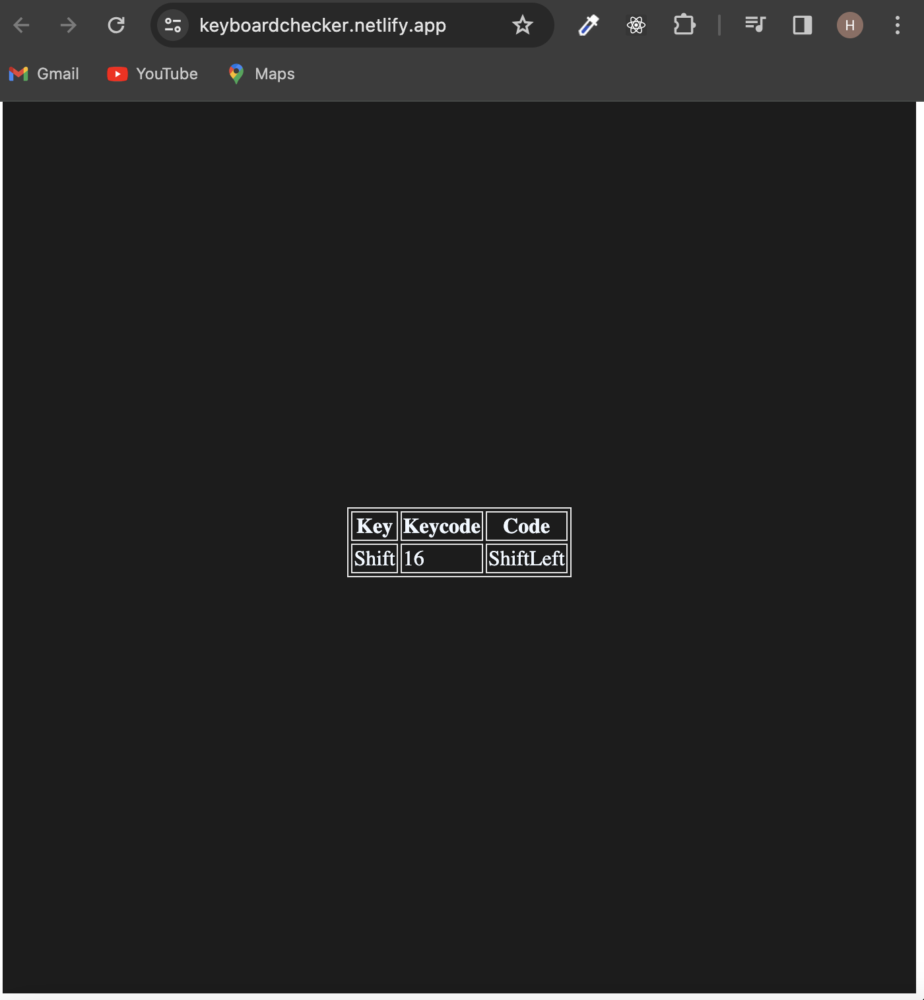

### Keyboard Checker Project Documentation

### Introduction

The Keyboard Checker is a web application designed to help users test and visualize the functionality of their computer keyboard. This project aims to provide a simple and interactive tool for users to check the responsiveness and accuracy of their keyboard input.

## Demo :

### You can Check it Live on Below Link :

[Live Link !](https://keyboardchecker.netlify.app/)